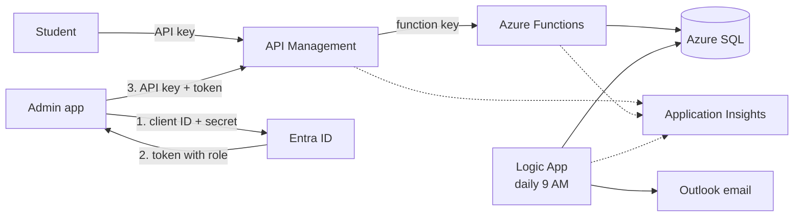
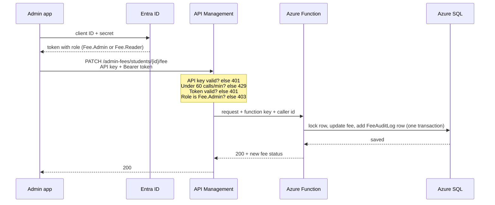
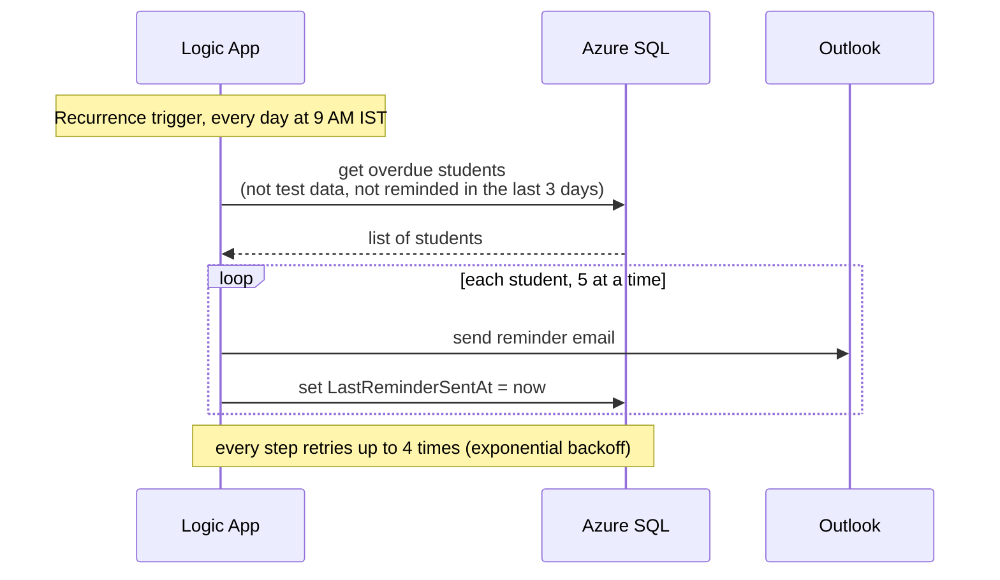

# Fee Management System on Azure

A serverless backend for managing student fees.
- Students check their fee status through an API (API key + rate limit).
- Admins search and update fee records through an API secured with Azure AD (Entra ID) roles.
- Students with overdue fees get an email reminder every morning.

**Built with:** Azure SQL Database, Azure Functions (Python), API Management, Entra ID, Logic Apps (Outlook), Application Insights.

## Architecture



- **API Management** is the only entry point. It checks the API key and rate limit, and for admin calls it also validates the Entra ID token and role.
- **Azure Functions** contain the logic: fee status, search and update. Direct calls without the function key are rejected, so clients must go through APIM.
- **Azure SQL** stores the `Students`, `Administrators` and `FeeAuditLog` tables.
- **Logic App** runs every day at 9 AM (IST), finds overdue students and emails them.

### Admin fee update



### Daily reminders



## Requirements

| Requirement | Where |
|---|---|
| SQL tables + 20 sample students | `database/01_schema.sql`, `database/02_seed_data.sql` |
| 5,000+ records | `database/03_load_test_data.sql` (5,000 test rows), index on `DueDate`, paging in the search API |
| Payment status API (Paid / Partially Paid / Overdue) | `functions/function_app.py` |
| API Management with API keys + rate limiting | `apim/student-api-policy.xml`, `apim/admin-api-policy.xml` |
| Admin update secured with Azure AD + RBAC | `entra/app-roles.json`, `apim/admin-api-policy.xml`, `apim/admin-update-fee-policy.xml` |
| Automated reminders (Logic App + Outlook) | `logic-app/overdue-reminder-workflow.json` |
| Retry policies | every Logic App action (4 retries); database connection in the Function |
| Monitoring with Application Insights | Function, APIM and Logic App send logs; queries in `monitoring/queries.kql` |

## API

Base URL: `https://<apim-name>.azure-api.net`

| Method | Path | Who | Auth |
|---|---|---|---|
| GET | `/fees/students/{studentId}/status` | Student | `Ocp-Apim-Subscription-Key` |
| GET | `/admin-fees/students?status=&course=&page=&pageSize=` | Fee.Admin, Fee.Reader | API key + `Authorization: Bearer <token>` |
| PATCH | `/admin-fees/students/{studentId}/fee` | Fee.Admin only | API key + `Authorization: Bearer <token>` |

Example response:
```json
{ "studentId": 1003, "name": "Vivaan Gupta", "course": "B.Tech CSE",
  "totalFee": 150000.0, "paidAmount": 50000.0, "balance": 100000.0,
  "dueDate": "2026-09-14", "daysOverdue": 11, "status": "Overdue" }
```

PATCH body (any of these fields): `{"paidAmount": 45000, "totalFee": 90000, "dueDate": "2026-10-30"}`.
Every update is saved in `FeeAuditLog` with who changed it, the old and new values, and when.

**Status rules:** fully paid → `Paid` · past due date → `Overdue` · some amount paid → `Partially Paid` · nothing paid yet and not due → `Pending`.

## Security

- **API keys:** separate keys for the student and admin APIs. No key → 401.
- **Rate limits:** 20 calls/min (student), 60 calls/min (admin). Over the limit → 429.
- **Azure AD token:** admin calls need a valid Entra ID token with a `Fee.Admin` or `Fee.Reader` role. Invalid or expired token → 401.
- **RBAC:** only `Fee.Admin` can update fees. A `Fee.Reader` token gets 403.
- **Function key:** only APIM has it, so the Function can't be called directly.
- **Secrets** (SQL password, keys, client secrets) are not in this repository. They are stored in Azure app settings, APIM named values and a local `.env` file.

## Testing results

- All four statuses tested with demo students 1001 (Paid), 1002 (Partially Paid), 1003 (Overdue), 1007 (Pending).
- Security: no key → 401, reader update → 403, admin update → 200 with an audit row, direct Function call → 401.
- Reminders: the Logic App sent 7 emails to overdue students. Running it again the same day sent none (a student is reminded at most once every 3 days).
- The status API responds in about 150 ms when the database is awake.

## Notes and assumptions

- I added a 4th status, `Pending`, for students who haven't paid anything and aren't due yet.
- Extra columns: `Email` (for reminders), `LastReminderSentAt` (to avoid daily repeats), `IsTestData` (test rows never get emails).
- "Today" is calculated in Indian time (IST), because Azure runs in UTC.
- Admin access uses two demo client apps, `fee-admin-client` (Fee.Admin) and `fee-reader-client` (Fee.Reader).
- The database is on the free serverless tier and pauses when idle, so the first call after a break is slow. The Function retries the connection.
- Not done yet: student login (right now any holder of the student key can check any student ID), Key Vault, private networking.

## Deployment

See [docs/DEPLOYMENT.md](docs/DEPLOYMENT.md).

## Project structure

```
database/     SQL scripts: tables, sample data, 5,000 test rows, audit log
functions/    Azure Functions app (Python)
apim/         API Management policies
entra/        App roles for Entra ID
logic-app/    Reminder workflow
monitoring/   Application Insights queries
docs/         Deployment guide
```
